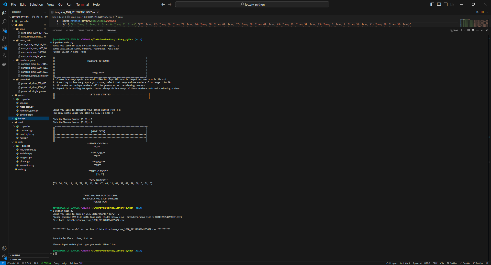

# Lottery Games Simulator
Lottery Games Simulator is an application that does three things.
1. Simulates four lottery games; Keno, Powerball, Numbers Game, Mass Cash. 
2. Stores individual and simulated game data into respective csv files located under parent data folder in root directory of project.
3. Enables the converting of csv game data to graph data using matplotlib.

## Installation
1. Clone this repository in IDE terminal: `https://github.com/jay323p/lottery_python.git`
2. Install all python dependencies using this command: `pip install -r requirements.txt`

## Usage
1. Run the program using this command: `python main.py`
2. Determine which feature you would like to run.
   - Enter `p` if playing lottery games is desired.
   - Enter `v` if viewing game data through graphs is desired
3. If entered `p`:
   - Select game to play by typing into terminal one of the following; `keno`, `numbers`, `powerball`, or `mass cash`.
   - Next prompt is to enter if simulated games are desired or regular play: enter `y` or `n` accordingly. 
      - If `y` entered, type into terminal the amount of simulations desired up to 100000.
   - Follow directions in terminal to play games accordingly.
4. If entered `v`:
   - Search your data folder for the csv file you desire to graph.
   - Once found, copy the relative path to that csv file and paste it to your terminal.
   - Enter `line` for line graph and `scatter` for scatter plot on next terminal prompt

## Contributing
1. Fork this repository
2. Create a new branch: `git checkout -b feature/new-feature`
3. Commit your changes: `git commit -am 'feature-name'`
4. Push to branch: `git push origin feature/new-feature`

## Image
Here is an example of the project structure showing how the csv files are stored in the data folder. Accordingly, the terminal prompting and example game result are shown as well.

